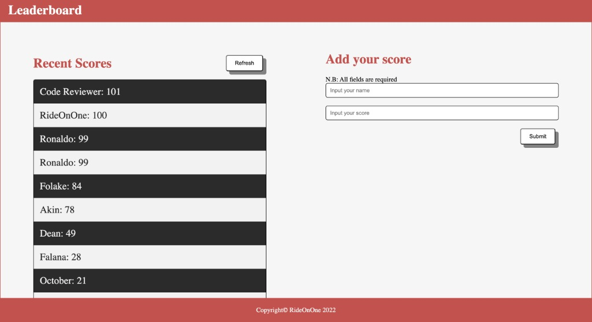

# leaderboard
The leaderboard website displays scores submitted by different players. It also allows you to submit your score

## Built With

- HTML5, Javascript
- CSS3
- Linters
- Webpack

## Live Demo

[Live Demo Link](https://kendoriddy.github.io/Leaderboard/)

## Getting Started

To get a local copy up and running follow these simple example steps.

## Prerequisites

- Have a good knowledge on how to parse UI designs
- Have VSCode or other text editor installed. [Link to download VSCode](https://code.visualstudio.com/download)
- Install node package. [Link to download node](https://nodejs.org/en/download/)
- Have git installed.[Link to download git](https://git-scm.com/downloads)
- Create a github repository.

## Setup

- git clone https://github.com/kendoriddy/Leaderboard.git
- cd Leaderboard/
  -Follow the HTML-CSS linter configuration to docs to setup linters [Link to Microverse linter docs](https://github.com/kendoriddy/linters-config/tree/master/html-css-js)
- Setup webpack configuration to bundle up your javascript modules. Follow the instructions from the [getting started guide](https://webpack.js.org/guides/getting-started/#basic-setup) to set up the basics

## Run tests

For tracking linters errors locally, you need to follow these steps:

- For tracking linter errors in HTML file run:
  `npx hint .`
- For tracking linter errors in CSS file run:
  `npx stylelint "**/*.{css,scss}"`
- For tracking linter errors in Javascript file run:
  `npx eslint .`

## Deployment

- Use GitHub pages to deploy website
- For more information about publishing sources, see [About github pages](https://pages.github.com/)

## Authors

👤 **Kehinde Ridwan Onifade**

- GitHub: [@githubhandle](https://github.com/kendoriddy)

- LinkedIn: [LinkedIn](https://www.linkedin.com/in/kehindeonifade/)
## 🤝 Contributing

Contributions, issues, and feature requests are welcome!

Feel free to check the [issues page](../../issues/).

## Show your support

Give a ⭐️ if you like this project!

## Acknowledgments

- Microverse
- Code Reviewers

## 📝 License

This project is [MIT](./MIT.md) licensed.